# GitHub Composite Actions

Reusable GitHub Composite Actions for environment preparation and image versioning across CI/CD pipelines.

## Repository Structure

```text
.github/
└── actions/
    ├── env-prepare-auto/
    │   └── action.yml
    ├── env-prepare-manual/
    │   └── action.yml
    ├── generate-image/
    │   └── action.yml
    ├── image-versioning/
    │   └── action.yml
    └── registry-login/
        └── action.yml
    
```

---

## Overview

This repository provides two approaches for environment preparation:

| Action                                    | Description                                                      |
| ----------------------------------------- | ---------------------------------------------------------------- |
| [env-prepare-manual](#env-prepare-manual) | Environment is selected explicitly by the workflow or user       |
| [env-prepare-auto](#env-prepare-auto)     | Environment is determined automatically from branch/tag patterns |
| [generate-image](#generate-image)         | Generates image versions and image tags                          |
| [image-versioning](#image-versioning)     | Generates image versions and raw image tags based on Git Ref     |
| [registry-login](#dynamic-registry-login) | Dynamically authenticates Docker to AWS ECR, GCP GAR, or GHCR    |

---

## Choosing Between Auto and Manual

| Capability                                      | env-prepare-manual | env-prepare-auto |
| ----------------------------------------------- | ------------------ | ---------------- |
| User selects environment                        | ✅                  | ❌             |
| Environment determined from branch/tag          | ❌                  | ✅             |
| Same branch can deploy to multiple environments | ✅                  | ❌             |
| GitFlow support                                 | ⚠️                  | ✅             |
| Workflow Dispatch friendly                      | ✅                  | ⚠️             |
| Multi-team platform friendly                    | ✅                  | ⚠️             |

### Example

Manual Mode:

```text
feature/login
    ↓
Development

feature/login
    ↓
Staging
```

Auto Mode:

```text
feature/login
    ↓
Staging
```

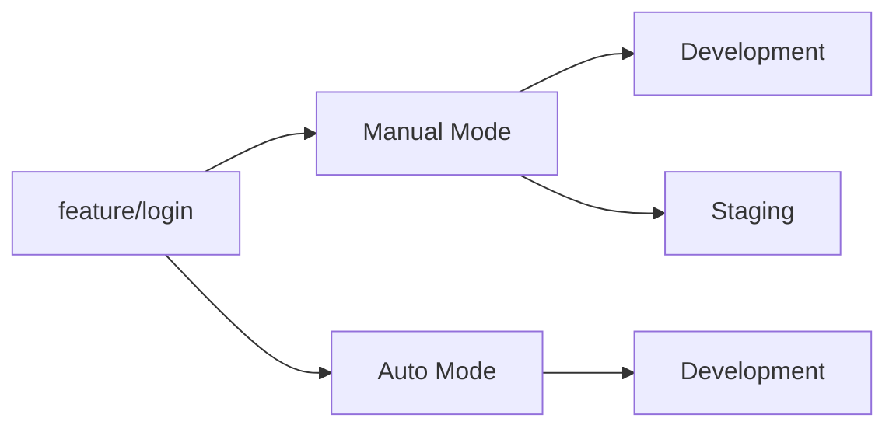

---

# Environment Preparation


## env-prepare-manual

### Overview

Allows the workflow or operator to explicitly select the target deployment environment.

This approach is useful when the same Git branch must be promoted across multiple environments during the delivery lifecycle.


### Inputs

| Input | Type | Required | Default | Description |
| :--- | :--- | :---: | :--- | :--- |
| `environment` | `string` | **Yes** | - | Upper-case validated environment name (`Development`, `Staging`, `Canary`, `Production`) |
| `provider` | `string` | **Yes** | - | Targeted Cloud Registry Provider (`AWS`, `GCP`, `GHCR`, or `DockerHub`) |
| `image_name` | `string` | **Yes** | - | Base name of your microservice or application (e.g., `auth-api`) |
| `image_suffix` | `string` | No | `''` | Optional structural modifier tag suffix (e.g., `alpine`, `slim`) |
| `registry_domain` | `string` | **Yes** | - | Main registry URL domain (e.g., `ghcr.io`, `asia-southeast2-docker.pkg.dev` or `123456789.dkr.ecr.us-east-1.amazonaws.com`) |
| `registry_repo` | `string` | No | `''` | Default fallback repository namespace or central shared project ID |
| `registry_repo_dev` | `string` | No | `''` | Explicit GCP Project ID / Repository tailored specifically for the **Development** cluster |
| `registry_repo_stg` | `string` | No | `''` | Explicit GCP Project ID / Repository tailored specifically for the **Staging** cluster |
| `registry_repo_prd` | `string` | No | `''` | Explicit GCP Project ID / Repository tailored specifically for the **Production** cluster |


### Supported Environments

| Environment | Description                   |
| ----------- | ----------------------------- |
| Development | Development environment       |
| Staging     | Staging environment           |
| Canary      | Canary deployment environment |
| Production  | Production environment        |

### Validation Rules

| Environment | Allowed Git Reference                        |
| ----------- | -------------------------------------------- |
| Development | Any branch                                   |
| Staging     | Any branch                                   |
| Canary      | Alpha/Beta/RC tags (^v.*-(alpha|beta|rc))    |
| Production  | Release tags (^v[0-9])                       |


---

### Typical Promotion Flow

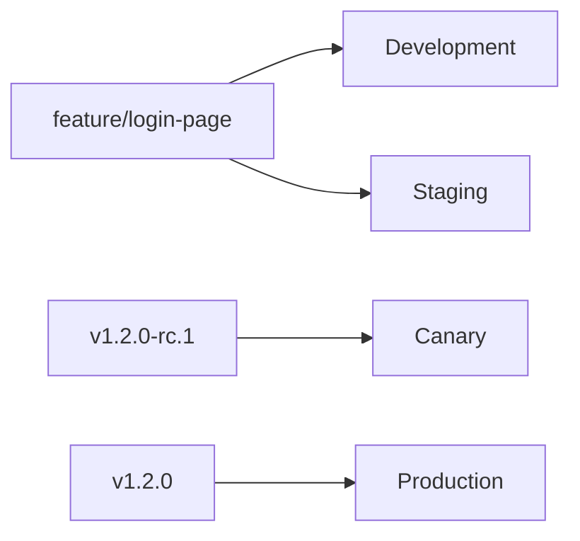
---

### Use Case - Workflow Dispatch

This is the most common implementation for manual mode.

The deployment target is selected when triggering the workflow.

#### Workflow Example: GHCR (Github Container Registry)

```yaml
workflow_dispatch:
  inputs:
    environment:
      description: Environment
      required: true
      type: choice
      options:
        - Development
        - Staging
        - Production

env:
  PROVIDER: GHCR
  REGISTRY_DOMAIN: ghcr.io
  REGISTRY_REPO: ionehouten
  IMAGE_NAME: auth-api

jobs:
  GlobalVariable:
    runs-on: ubuntu-latest

    steps:
      - name: Prepare Environment (Manual)
        id: prepare
        uses: ionehouten/devops-kangservice/.github/actions/env-prepare-manual@main
        with:
          environment: ${{ inputs.environment }}
          provider: ${{ env.PROVIDER }}
          registry_domain: ${{ env.REGISTRY_DOMAIN }}
          registry_repo: ${{ env.REGISTRY_REPO }}
          image_name: ${{ env.IMAGE_NAME }}
```

#### Workflow Example: AWS (Elastic Container Registry)

```yaml
workflow_dispatch:
  inputs:
    environment:
      description: Environment
      required: true
      type: choice
      options:
        - Development
        - Staging
        - Production

env:
  PROVIDER: AWS
  REGISTRY_DOMAIN: 810671271780.dkr.ecr.ap-southeast-3.amazonaws.com
  IMAGE_NAME: auth-api

jobs:
  GlobalVariable:
    runs-on: ubuntu-latest

    steps:
      - name: Prepare Environment (Manual)
        id: prepare
        uses: ionehouten/devops-kangservice/.github/actions/env-prepare-manual@main
        with:
          environment: ${{ inputs.environment }}
          provider: ${{ env.PROVIDER }}
          registry_domain: ${{ env.REGISTRY_DOMAIN }}
          image_name: ${{ env.IMAGE_NAME }}
```

#### Workflow Example: GCP Shared Project (Google Artifact Registry)

```yaml
workflow_dispatch:
  inputs:
    environment:
      description: Environment
      required: true
      type: choice
      options:
        - Development
        - Staging
        - Production

env:
  PROVIDER: GCP
  REGISTRY_DOMAIN: asia-southeast2-docker.pkg.dev
  REGISTRY_REPO: my-project-shared/my-image # Format: {GCP_PROJECT_ID}/{GAR_NAME}
  IMAGE_NAME: auth-api

jobs:
  GlobalVariable:
    runs-on: ubuntu-latest

    steps:
      - name: Prepare Environment (Manual)
        id: prepare
        uses: ionehouten/devops-kangservice/.github/actions/env-prepare-manual@main
        with:
          environment: ${{ inputs.environment }}
          provider: ${{ env.PROVIDER }}
          registry_domain: ${{ env.REGISTRY_DOMAIN }}
          registry_repo: ${{ env.REGISTRY_REPO }}
          image_name: ${{ env.IMAGE_NAME }}

```
#### Workflow Example: GHCR (Github Container Registry)

```yaml
workflow_dispatch:
  inputs:
    environment:
      description: Environment
      required: true
      type: choice
      options:
        - Development
        - Staging
        - Production

env:
  PROVIDER: GHCR
  REGISTRY_DOMAIN: ghcr.io
  REGISTRY_REPO: ionehouten
  IMAGE_NAME: auth-api

jobs:
  GlobalVariable:
    runs-on: ubuntu-latest

    steps:
      - name: Prepare Environment (Manual)
        id: prepare
        uses: ionehouten/devops-kangservice/.github/actions/env-prepare-manual@main
        with:
          environment: ${{ inputs.environment }}
          provider: ${{ env.PROVIDER }}
          registry_domain: ${{ env.REGISTRY_DOMAIN }}
          registry_repo: ${{ env.REGISTRY_REPO }}
          image_name: ${{ env.IMAGE_NAME }}
```

#### Workflow Example: GCP Multiple Project (Google Artifact Registry)

```yaml
workflow_dispatch:
  inputs:
    environment:
      description: Environment
      required: true
      type: choice
      options:
        - Development
        - Staging
        - Production

env:
  PROVIDER: GCP
  REGISTRY_DOMAIN: asia-southeast2-docker.pkg.dev
  REGISTRY_REPO_DEV: my-project-dev/my-image # Format: {GCP_PROJECT_ID_DEV}/{GAR_NAME}
  REGISTRY_REPO_STG: my-project-stg/my-image # Format: {GCP_PROJECT_ID_STG}/{GAR_NAME}
  REGISTRY_REPO_PRD: my-project-prd/my-image # Format: {GCP_PROJECT_ID_PRD}/{GAR_NAME}
  IMAGE_NAME: auth-api

jobs:
  GlobalVariable:
    runs-on: ubuntu-latest

    steps:
      - name: Prepare Environment (Manual)
        id: prepare
        uses: ionehouten/devops-kangservice/.github/actions/env-prepare-manual@main
        with:
          environment: ${{ inputs.environment }}
          provider: ${{ env.PROVIDER }}
          registry_domain: ${{ env.REGISTRY_DOMAIN }}
          registry_repo_dev: ${{ env.REGISTRY_REPO_DEV }}
          registry_repo_stg: ${{ env.REGISTRY_REPO_STG }}
          registry_repo_prd: ${{ env.REGISTRY_REPO_PRD }}
          image_name: ${{ env.IMAGE_NAME }}


```

#### Workflow Example: Single Job Multi-Step Approach

```yaml
workflow_dispatch:
  inputs:
    environment:
      description: Environment
      required: true
      type: choice
      options:
        - Development
        - Staging
        - Production

env:
  PROVIDER: GHCR
  REGISTRY_DOMAIN: ghcr.io
  REGISTRY_REPO: ionehouten
  IMAGE_NAME: auth-api

jobs:
  GlobalVariable:
    runs-on: ubuntu-latest
    steps:
      - name: Prepare Environment (Manual)
        id: prepare
        uses: ionehouten/devops-kangservice/.github/actions/env-prepare-manual@main
        with:
          environment: ${{ inputs.environment }}
          provider: ${{ env.PROVIDER }}
          registry_domain: ${{ env.REGISTRY_DOMAIN }}
          registry_repo: ${{ env.REGISTRY_REPO }}
          image_name: ${{ env.IMAGE_NAME }}
      
      - name: Build
        ......
    
```
#### Workflow Example: Multi-Job Workflow Approach

```yaml
workflow_dispatch:
  inputs:
    environment:
      description: Environment
      required: true
      type: choice
      options:
        - Development
        - Staging
        - Production

env:
  PROVIDER: GHCR
  REGISTRY_DOMAIN: ghcr.io
  REGISTRY_REPO: ionehouten
  IMAGE_NAME: auth-api

jobs:
  GlobalVariable:
    runs-on: ubuntu-latest
    outputs:
      environment: ${{ steps.prepare.outputs.environment }}
      environment_suffix: ${{ steps.prepare.outputs.environment_suffix }}
      image_suffix: ${{ steps.prepare.outputs.image_suffix }}
      overlays_path: ${{ steps.prepare.outputs.overlays_path }}

      short_sha: ${{ steps.prepare.outputs.short_sha }}
      version: ${{ steps.prepare.outputs.version }}
      image_ref: ${{ steps.prepare.outputs.image_ref }}
      image_ref_latest: ${{ steps.prepare.outputs.image_ref_latest }}
      is_release: ${{ steps.prepare.outputs.is_release }}
      is_default_branch: ${{ steps.prepare.outputs.is_default_branch }}
      
    steps:
      - name: Prepare Environment (Manual)
        id: prepare
        uses: ionehouten/devops-kangservice/.github/actions/env-prepare-manual@main
        with:
          environment: ${{ inputs.environment }}
          provider: ${{ env.PROVIDER }}
          registry_domain: ${{ env.REGISTRY_DOMAIN }}
          registry_repo: ${{ env.REGISTRY_REPO }}
          image_name: ${{ env.IMAGE_NAME }}
      
  Build:
    runs-on: ubuntu-latest
    .........
    
```


#### Flow

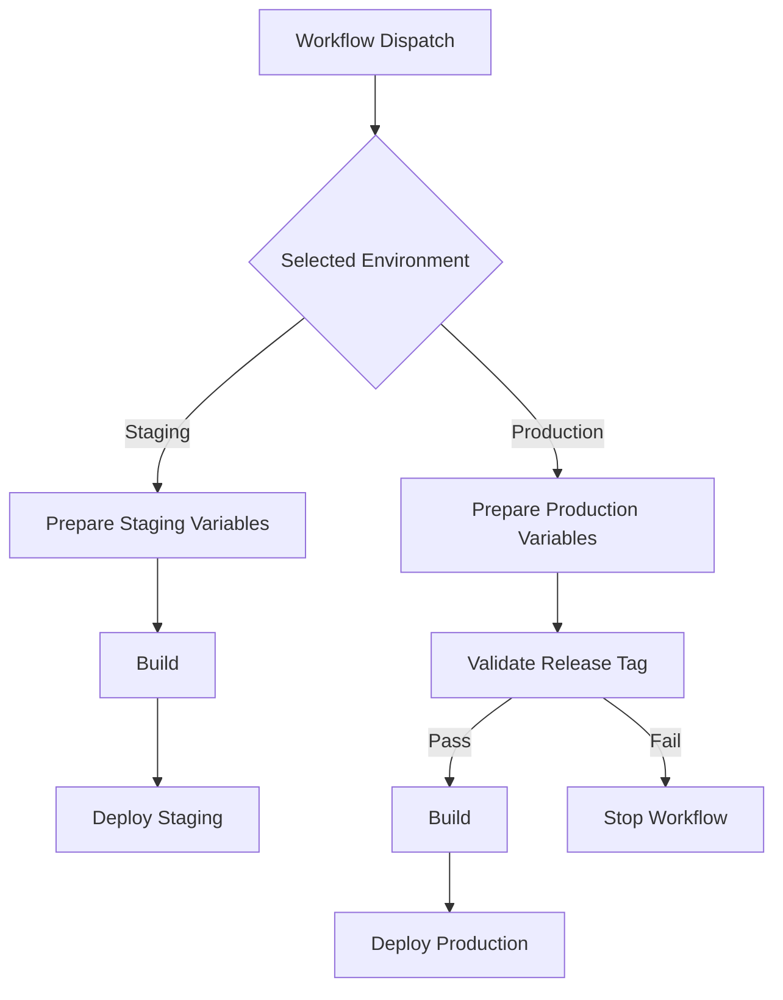

---

### Use Case 1 - Feature Branch Testing

Git Reference:

```text
feature/login-page
```

Workflow:

```yaml
- uses: ionehouten/devops-kangservice/.github/actions/env-prepare-manual@main
  with:
    environment: Development
```

Result:

```text
Environment       : Development
Overlay Path      : development
Image Environment : dev
```

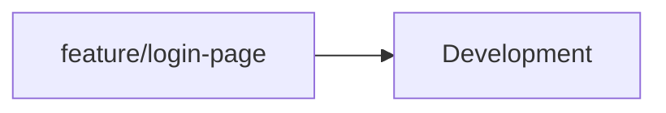

---

### Use Case 2 - Feature Branch QA Validation

Git Reference:

```text
feature/login-page
```

Workflow:

```yaml
- uses: ionehouten/devops-kangservice/.github/actions/env-prepare-manual@main
  with:
    environment: Staging
```

Result:

```text
Environment       : Staging
Overlay Path      : staging
Image Environment : stg
```


---

### Use Case 3 - Promotion Without Merge

The same branch can be deployed to multiple environments.

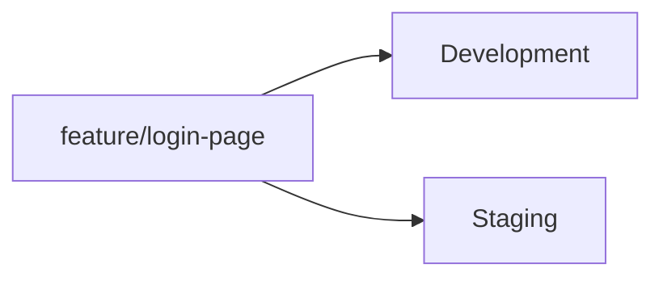

---

### Use Case 4 - Release Candidate Validation

Git Reference:

```text
v1.2.0-rc.1
```

Workflow:

```yaml
- uses: ionehouten/devops-kangservice/.github/actions/env-prepare-manual@main
  with:
    environment: Canary
```

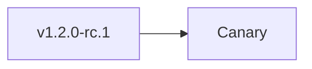

---

### Use Case 5 - Production Release

Git Reference:

```text
v1.2.0
```

Workflow:

```yaml
- uses: ionehouten/devops-kangservice/.github/actions/env-prepare-manual@main
  with:
    environment: Production
```

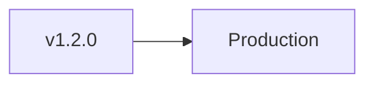

---


---

## env-prepare-auto

### Overview

Automatically determines the deployment environment based on Git reference patterns.


### Inputs

| Input | Type | Required | Default | Description |
| :--- | :--- | :---: | :--- | :--- |
| `development_pattern` | `regex` | **Yes** | ^develop$  | Regex allowed for Development |
| `staging_pattern` | `regex` | **Yes** | ^main$ | Regex allowed for Staging |
| `canary_pattern` | `regex` | **Yes** | ^v.*-(alpha|beta|rc) | Regex allowed for Canary |
| `production_pattern` | `regex` | **Yes** | ^v[0-9] | Regex allowed for Production |
| `provider` | `string` | **Yes** | - | Targeted Cloud Registry Provider (`AWS`, `GCP`, `GHCR`, or `DockerHub`) |
| `image_name` | `string` | **Yes** | - | Base name of your microservice or application (e.g., `auth-api`) |
| `image_suffix` | `string` | No | `''` | Optional structural modifier tag suffix (e.g., `alpine`, `slim`) |
| `registry_domain` | `string` | **Yes** | - | Main registry URL domain (e.g., `ghcr.io`, `asia-southeast2-docker.pkg.dev` or `123456789.dkr.ecr.us-east-1.amazonaws.com`) |
| `registry_repo` | `string` | No | `''` | Default fallback repository namespace or central shared project ID |
| `registry_repo_dev` | `string` | No | `''` | Explicit GCP Project ID / Repository tailored specifically for the **Development** cluster |
| `registry_repo_stg` | `string` | No | `''` | Explicit GCP Project ID / Repository tailored specifically for the **Staging** cluster |
| `registry_repo_prd` | `string` | No | `''` | Explicit GCP Project ID / Repository tailored specifically for the **Production** cluster |


### Evaluation Order

```text
Production
↓
Canary
↓
Staging
↓
Development
```

The first matching pattern wins.

### Workflow

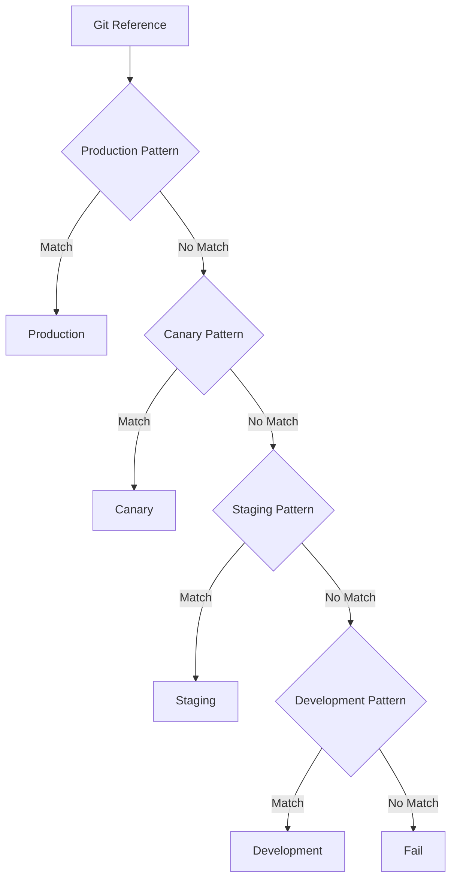

---

### Use Case 1 - GitFlow

```yaml
- uses: ionehouten/devops-kangservice/.github/actions/env-prepare-auto@main
  with:
    development_pattern: "^(develop|feature/.*)$"
    staging_pattern: "^main$"
```

| Git Reference | Environment |
| ------------- | ----------- |
| develop       | Development |
| feature/v1.0  | Development |
| main          | Staging     |
| v1.0.0-rc.1   | Canary      |
| v1.0.0        | Production  |

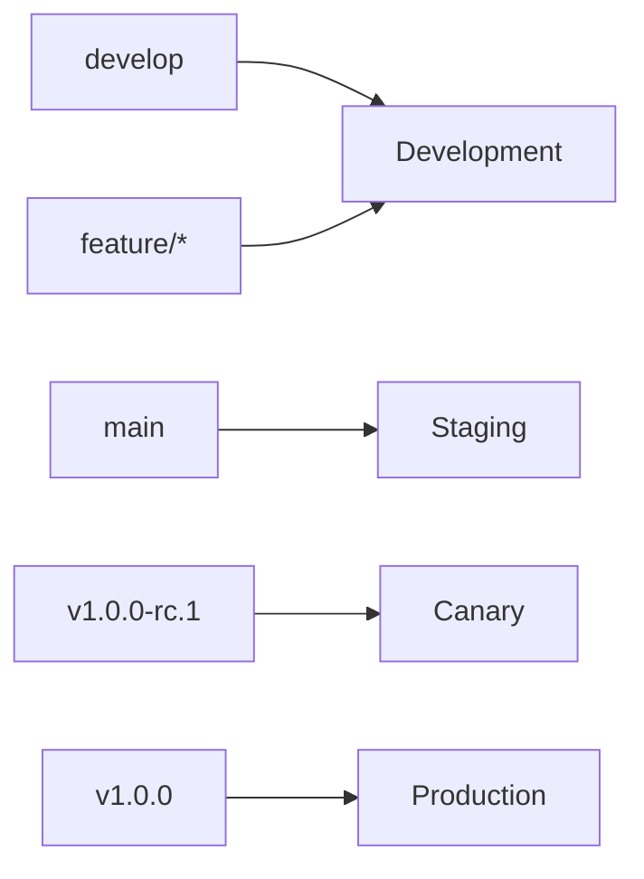

---

### Use Case 2 - Feature Branch Promotion

```yaml
- uses: ionehouten/devops-kangservice/.github/actions/env-prepare-auto@main
  with:
    development_pattern: "^main$"
    staging_pattern: "^(develop|feature/.*)$"
```

| Git Reference   | Environment |
| --------------- | ----------- |
| develop         | Development |
| feature/login   | Development |
| feature/payment | Development |
| main            | Staging     |
| v1.0.0          | Production  |

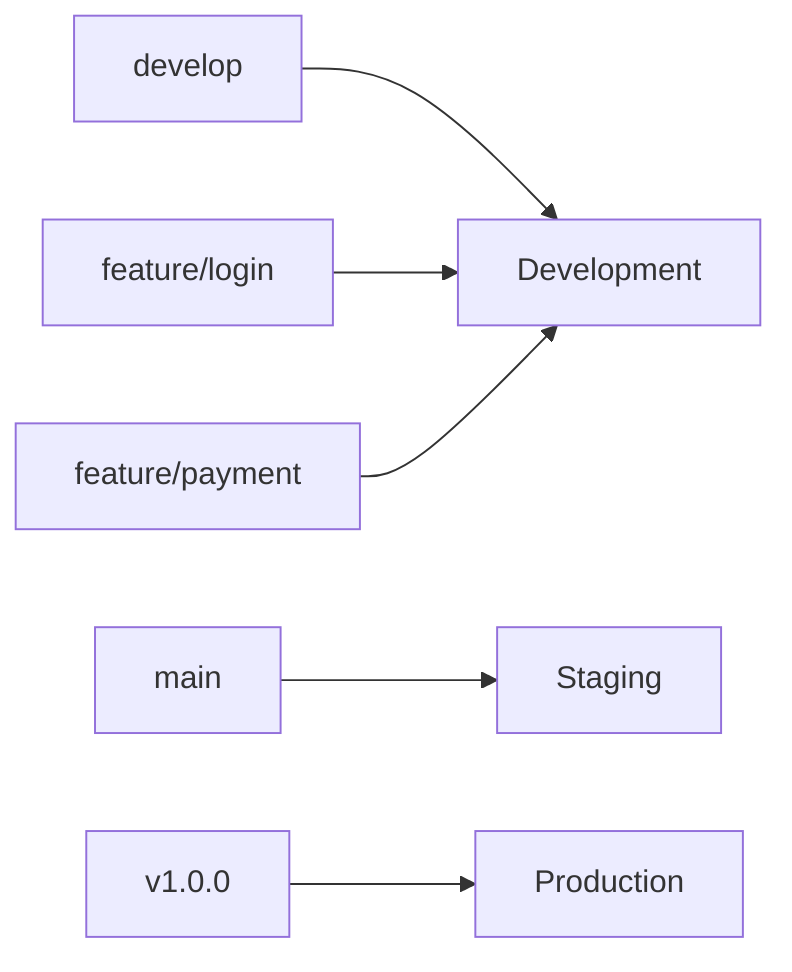

---


## Outputs

Both actions expose identical outputs.

| Output             | Description                                         |
| ------------------ | --------------------------------------------------- |
| environment        | Target environment                                  |
| environment_suffix | Environment suffix                                  |
| image_suffix       | Image environment suffix                            |
| overlays_path      | Target deployment folder mapping name               |
| image_repo         | The finalized Image Repository URL without tags     |
| image_ref          | Full image registry URL with version tag            |
| image_ref_latest   | Full image registry URL with latest tag             |
| short_sha          | Git commit short SHA (7 characters)                 |
| version            | Resolved version string (tag name or branch prefix) |


# Core Internal Generator

## generate-image
### Overview
This is the back-end core engine of the environment preparation module. It handles the specific complexity of structuring container image paths and tags based on your Cloud Architecture Strategy. 

Whether your organization uses a **Centralized Shared DevOps Project** (single container registry for all envs) or a **GCP Multi-Project Isolation Layout** (dedicated GCP Project IDs per environment), this action automatically resolves the correct URLs without cluttering your main workflow files.

---

### Inputs

| Input | Type | Required | Default | Description |
| :--- | :--- | :---: | :--- | :--- |
| `environment` | `string` | **Yes** | - | Upper-case validated environment name (`Development`, `Staging`, `Canary`, `Production`) |
| `provider` | `string` | **Yes** | - | Targeted Cloud Registry Provider (`AWS`, `GCP`, or `GHCR`) |
| `image_name` | `string` | **Yes** | - | Base name of your microservice or application (e.g., `minipos`) |
| `image_suffix` | `string` | No | `''` | Optional structural modifier tag suffix (e.g., `alpine`, `slim`) |
| `registry_domain` | `string` | **Yes** | - | Main registry URL domain (e.g., `asia-southeast2-docker.pkg.dev` or `123456789.dkr.ecr.us-east-1.amazonaws.com`) |
| `registry_repo` | `string` | No | `''` | Default fallback repository namespace or central shared project ID |
| `registry_repo_dev` | `string` | No | `''` | Explicit GCP Project ID / Repository tailored specifically for the **Development** cluster |
| `registry_repo_stg` | `string` | No | `''` | Explicit GCP Project ID / Repository tailored specifically for the **Staging** cluster |
| `registry_repo_prd` | `string` | No | `''` | Explicit GCP Project ID / Repository tailored specifically for the **Production** cluster |

---

### Outputs

| Output | Type | Description |
| :--- | :--- | :--- |
| `image_repo` | `string` | The finalized Image Repository URL path without any version tags |
| `image_ref` | `string` | Full image registry URL populated with the specific calculated version tag |
| `image_ref_latest` | `string` | Full image registry URL populated with the `latest` tag (only appended if applicable) |
| `short_sha` | `string` | Extracted 7-character Git commit short SHA |
| `version` | `string` | Resolved raw version string (e.g., Git Tag name or `branch-<sanitized-name>`) |
| `is_release` | `string` | Boolean string (`true`/`false`) indicating if the build originates from a release tag |
| `is_default_branch` | `string` | Boolean string (`true`/`false`) indicating if the build originates from the default branch |

---

### Internal Fallback & Resolution Logic

The action evaluates the target container registry URL using a smart multi-project conditional fallback hierarchy:

1. **GCP Multi-Project Strategy:**
   If `provider` is set to `GCP` and the specific environment repository input is provided (e.g., `registry_repo_stg` for Staging), the action will isolate the image path inside that specific Google Cloud Project.
2. **Centralized Fallback Strategy:**
   If the specific environment repository input is left blank (`''`), the action gracefully falls back to the central `registry_repo` value. This is ideal for AWS ECR and GHCR setups.

### Flow Diagram
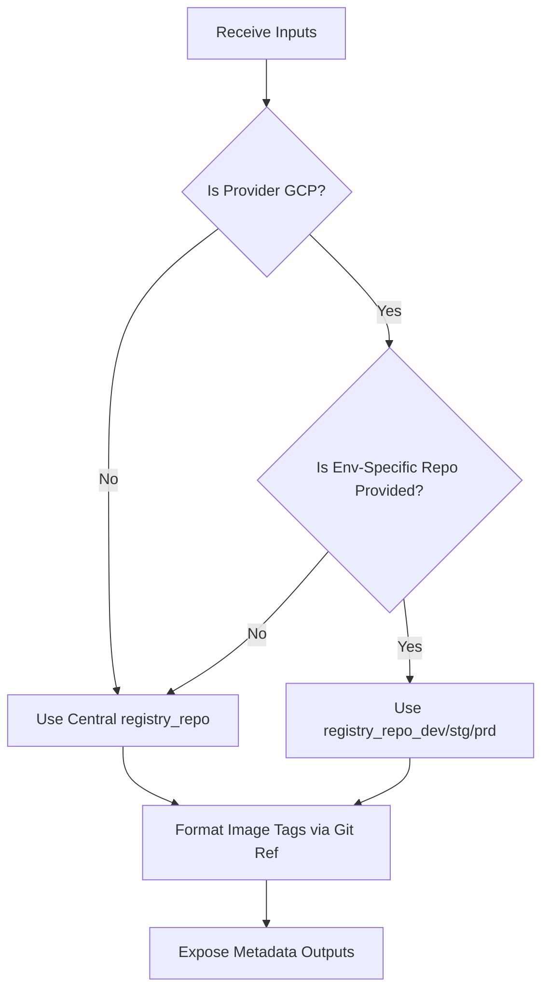

# Image Versioning

Generates image versions and container image tags automatically.

## Versioning Flow

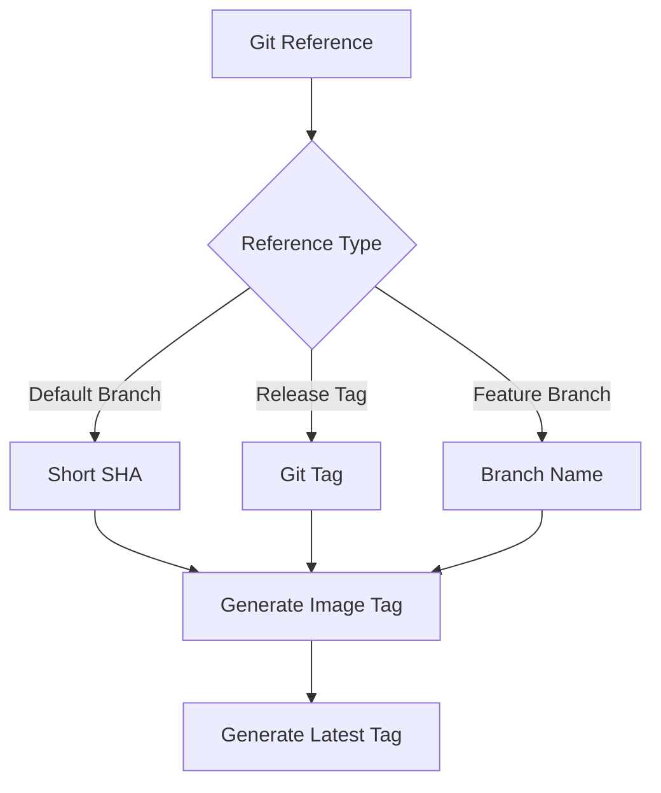
---
## Inputs

| Input          | Required | Description             |
| -------------- | -------- | ----------------------- |
| image_repo     | Yes      | Container registry path |
| image_suffix   | No       | Optional image suffix   |

## Outputs

| Output            | Description       |
| ----------------- | ----------------- |
| short_sha         | Git short SHA     |
| version           | Generated version |
| image_ref         | Full image tag    |
| image_ref_latest  | Latest image tag  |
| is_release        | LIs Release Tag   |
| is_default_branch | Is Default Branch |

---


# Dynamic Registry Login

This GitHub Composite Action is engineered specifically to handle **Multi-Cloud/Hybrid Infrastructure** environments. It intelligently detects the type of container registry (**AWS ECR**, **GCP Artifact Registry (GAR)**, or **GHCR**) based solely on the provided image repository URL string (`image_repo`) and dynamically executes the appropriate authentication flow.

By utilizing this action, your central workflow files (such as *security scanning*, *cosign image signing*, or *multi-cloud deployments*) can remain **100% reusable** without hardcoding repetitive conditional login logic across multiple jobs.

---

## Key Features

* **Auto-Routing Cloud Auth:** Automatically detects the cloud provider using GitHub Actions `contains()` expressions matching the domain structure of the registry.
* **Multi-Environment GCP Aware:** Dynamically selects the correct GCP *Service Account JSON* (`DEV`, `STG`, `PRD`) by cross-referencing the GCP Project ID embedded within the image path string.
* **Dual AWS Authentication:** Supports modern AWS authentication via **OIDC (Role to Assume)** as well as legacy **AWS Access Keys**.
* **Zero-Config GHCR Auth:** Leverages the runner's internal ephemeral token (`github.token`) for seamless and rapid authentication to the GitHub Container Registry.

---
## Authentication Workflow Diagram

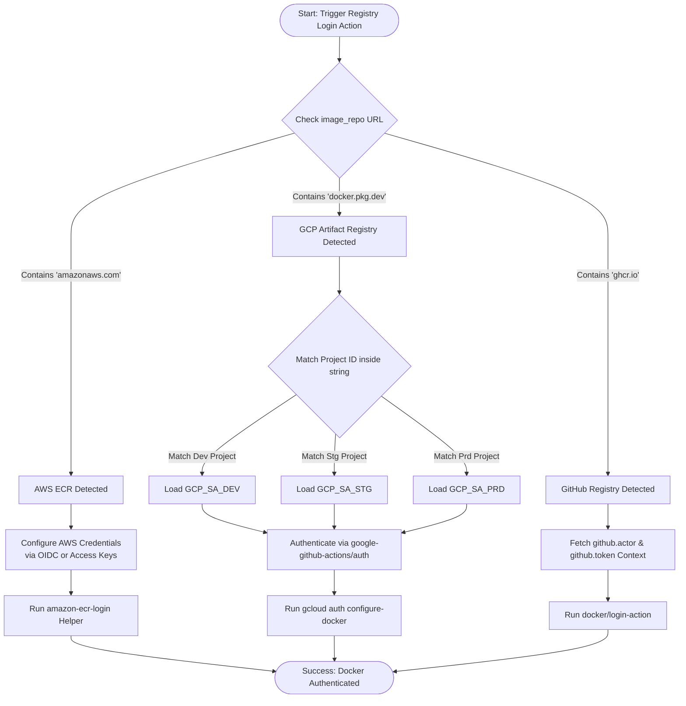
---

## Inputs

| Parameter | Type | Required | Description |
| :--- | :--- | :---: | :--- |
| `image_repo` | `string` | **Yes** | The full image repository URL (e.g., `ghcr.io/org/repo`, `*.dkr.ecr.*.amazonaws.com/repo`, or `*-docker.pkg.dev/project/repo`). |
| `aws_region` | `string` | No | Target AWS Region (Required if target registry is AWS ECR). |
| `aws_role_to_assume` | `string` | No | Target AWS Role ARN for OIDC-based token authentication. |
| `aws_access_key_id` | `string` | No | AWS Access Key ID (Use if not utilizing OIDC). |
| `aws_secret_access_key` | `string` | No | AWS Secret Access Key (Use if not utilizing OIDC). |
| `gcp_project_dev` | `string` | No | GCP Project ID for the Development environment. |
| `gcp_sa_dev` | `string` | No | GCP Service Account JSON for the Development environment. |
| `gcp_project_stg` | `string` | No | GCP Project ID for the Staging environment. |
| `gcp_sa_stg` | `string` | No | GCP Service Account JSON for the Staging environment. |
| `gcp_project_prd` | `string` | No | GCP Project ID for the Production environment. |
| `gcp_sa_prd` | `string` | No | GCP Service Account JSON for the Production environment. |
| `ghcr_registry` | `string` | No | Target GHCR domain URL. Defaults to `ghcr.io`. |

---

## Usage Example

You can leverage `secrets: inherit` on your parent Reusable Workflow, or pass your repository secrets directly into this Action's inputs as demonstrated below:

### Complete Sudo-Code Example (Supporting All Registries)

```yaml
jobs:
  ScanOrSign:
    runs-on: ubuntu-latest
    permissions:
      contents: read
      packages: read    # Essential for GHCR token authentication
      id-token: write   # Essential for AWS OIDC authentication
    steps:
      - name: Checkout Code
        uses: actions/checkout@v4

      - name: Authenticate to Registry
        uses: ionehouten/devops-kangservice/.github/actions/registry-login@main
        with:
          image_repo: ${{ inputs.image_repo }} # Intelligently parsed
          
          # AWS Variables
          aws_region: ${{ secrets.AWS_REGION }}
          aws_role_to_assume: ${{ secrets.AWS_ROLE_ARN }}
          
          # GCP Variables
          gcp_project_dev: ${{ secrets.GCP_PROJECT_ID_DEV }}
          gcp_sa_dev: ${{ secrets.GCP_SA_DEV }}
          gcp_project_stg: ${{ secrets.GCP_PROJECT_ID_STG }}
          gcp_sa_stg: ${{ secrets.GCP_SA_STG }}
          gcp_project_prd: ${{ secrets.GCP_PROJECT_ID_PRD }}
          gcp_sa_prd: ${{ secrets.GCP_SA_PRD }}
          
          # GHCR Variables
          ghcr_registry: "ghcr.io"

      - name: Run Trivy Scanner / Cosign
        run: |
          echo "Performing secure operations on image: ${{ inputs.image_repo }}"
```

# Recommendations

| Scenario                                                      | Recommended Action |
| ------------------------------------------------------------- | ------------------ |
| Developers choose deployment target manually                  | env-prepare-manual |
| Environment determined automatically from branch/tag strategy | env-prepare-auto   |
| GitFlow branching model (develop / feature/ / main)           | env-prepare-auto   |
| Multi-team standard promotion delivery platform               | env-prepare-manual |
| Raw core metadata and image URL composition logic             | generate-image     |
| Standard image versioning                                     | image-versioning   |

```
```
