# GitHub Composite Actions

Reusable GitHub Composite Actions for environment preparation and image versioning across CI/CD pipelines.

## Repository Structure

```text
.github/
└── actions/
    ├── env-prepare-manual/
    │   └── action.yml
    ├── env-prepare-auto/
    │   └── action.yml
    └── versioning-action/
        └── action.yml
```

---

## Overview

This repository provides two approaches for environment preparation:

| Action                                    | Description                                                      |
| ----------------------------------------- | ---------------------------------------------------------------- |
| [env-prepare-manual](#env-prepare-manual) | Environment is selected explicitly by the workflow or user       |
| [env-prepare-auto](#env-prepare-auto)     | Environment is determined automatically from branch/tag patterns |
| [versioning-action](#versioning-action)   | Generates image versions and image tags                          |

---

## Choosing Between Auto and Manual

| Capability                                      | env-prepare-manual | env-prepare-auto |
| ----------------------------------------------- | ------------------ | ---------------- |
| User selects environment                        | ✅                  | ❌                |
| Environment determined from branch/tag          | ❌                  | ✅                |
| Same branch can deploy to multiple environments | ✅                  | ❌                |
| GitFlow support                                 | ⚠️                 | ✅                |
| Workflow Dispatch friendly                      | ✅                  | ⚠️               |
| Multi-team platform friendly                    | ✅                  | ⚠️               |

### Example

Manual Mode:

```text
feature/login
    ↓
Development

feature/login
    ↓
Staging
```

Auto Mode:

```text
feature/login
    ↓
Staging
```

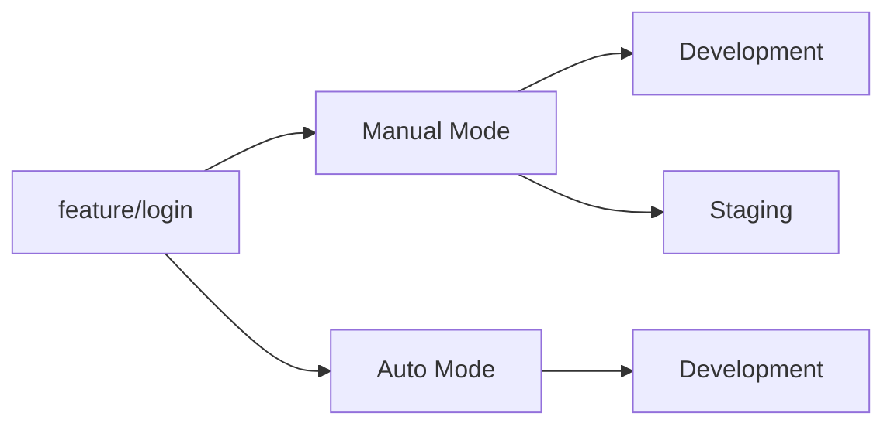

---

# Environment Preparation

## env-prepare-manual

### Overview

Allows the workflow or operator to explicitly select the target deployment environment.

This approach is useful when the same Git branch must be promoted across multiple environments during the delivery lifecycle.

### Supported Environments

| Environment | Description                   |
| ----------- | ----------------------------- |
| Development | Development environment       |
| Staging     | Staging environment           |
| Canary      | Canary deployment environment |
| Production  | Production environment        |

### Validation Rules

| Environment | Allowed Git Reference |
| ----------- | --------------------- |
| Development | Any branch            |
| Staging     | Any branch            |
| Canary      | Alpha/Beta/RC tags    |
| Production  | Release tags          |

---

### Typical Promotion Flow

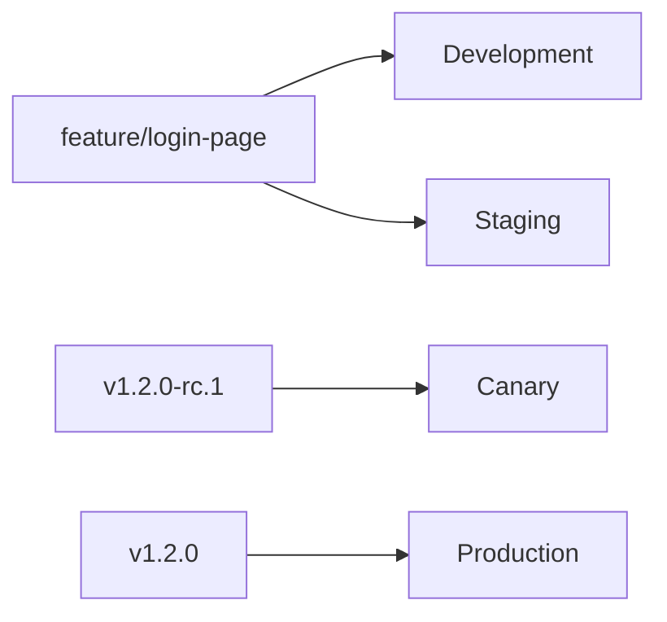
---

### Use Case - Workflow Dispatch

This is the most common implementation for manual mode.

The deployment target is selected when triggering the workflow.

#### Workflow Example

```yaml
workflow_dispatch:
  inputs:
    environment:
      description: Environment
      required: true
      type: choice
      options:
        - Development
        - Staging
        - Production

jobs:
  GlobalVariable:
    runs-on: ubuntu-latest

    steps:
      - name: Prepare Environment
        id: prepare
        uses: ionehouten/devops-kangservice/.github/actions/env-prepare-manual@main
        with:
          environment: ${{ inputs.environment }}
```

#### Flow

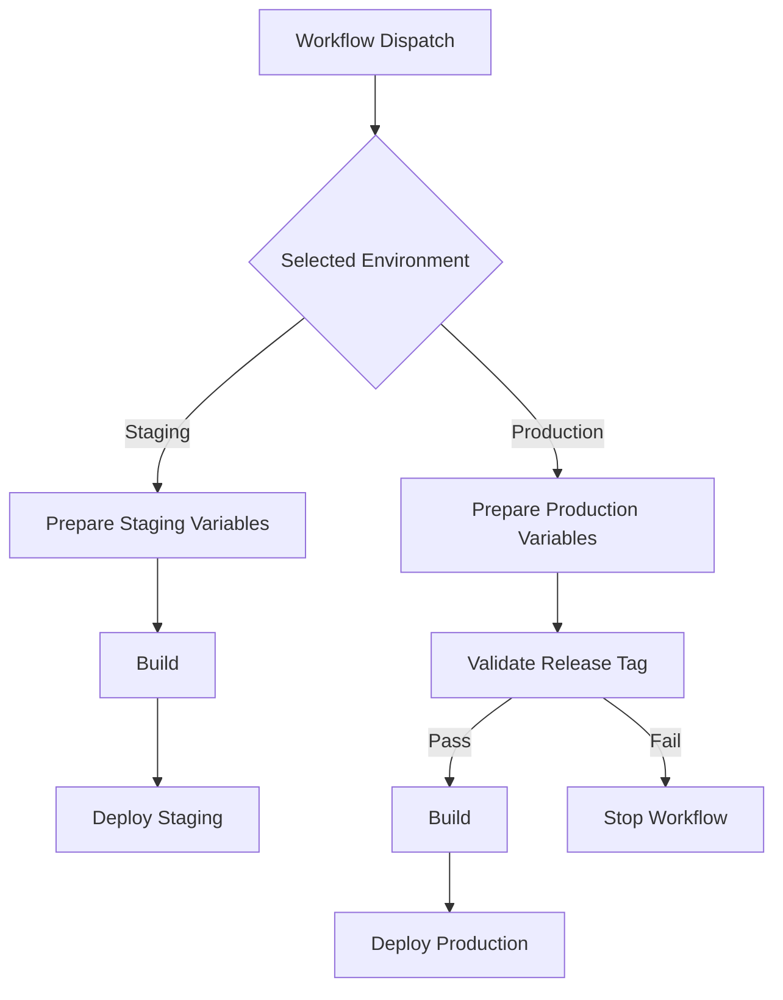

---

### Use Case 1 - Feature Branch Testing

Git Reference:

```text
feature/login-page
```

Workflow:

```yaml
- uses: ionehouten/devops-kangservice/.github/actions/env-prepare-manual@main
  with:
    environment: Development
```

Result:

```text
Environment       : Development
Overlay Path      : development
Image Environment : dev
```

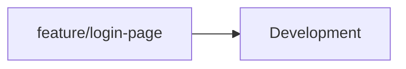

---

### Use Case 2 - Feature Branch QA Validation

Git Reference:

```text
feature/login-page
```

Workflow:

```yaml
- uses: ionehouten/devops-kangservice/.github/actions/env-prepare-manual@main
  with:
    environment: Staging
```

Result:

```text
Environment       : Staging
Overlay Path      : staging
Image Environment : stg
```


---

### Use Case 3 - Promotion Without Merge

The same branch can be deployed to multiple environments.

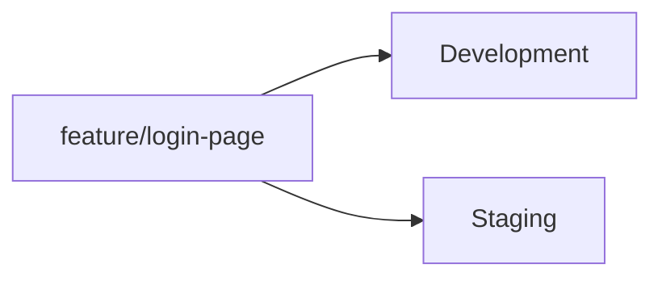

---

### Use Case 4 - Release Candidate Validation

Git Reference:

```text
v1.2.0-rc.1
```

Workflow:

```yaml
- uses: ionehouten/devops-kangservice/.github/actions/env-prepare-manual@main
  with:
    environment: Canary
```

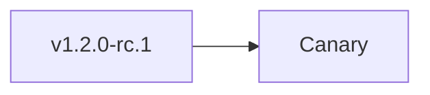

---

### Use Case 5 - Production Release

Git Reference:

```text
v1.2.0
```

Workflow:

```yaml
- uses: ionehouten/devops-kangservice/.github/actions/env-prepare-manual@main
  with:
    environment: Production
```

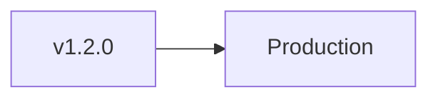

---


---

## env-prepare-auto

### Overview

Automatically determines the deployment environment based on Git reference patterns.

### Inputs

| Input               | Default              |
| ------------------- | -------------------- |
| development_pattern | ^main$               |
| staging_pattern     | ^staging$            |
| canary_pattern      | ^v.*-(alpha|beta|rc) |
| production_pattern  | ^v[0-9]              |

### Evaluation Order

```text
Production
↓
Canary
↓
Staging
↓
Development
```

The first matching pattern wins.

### Workflow

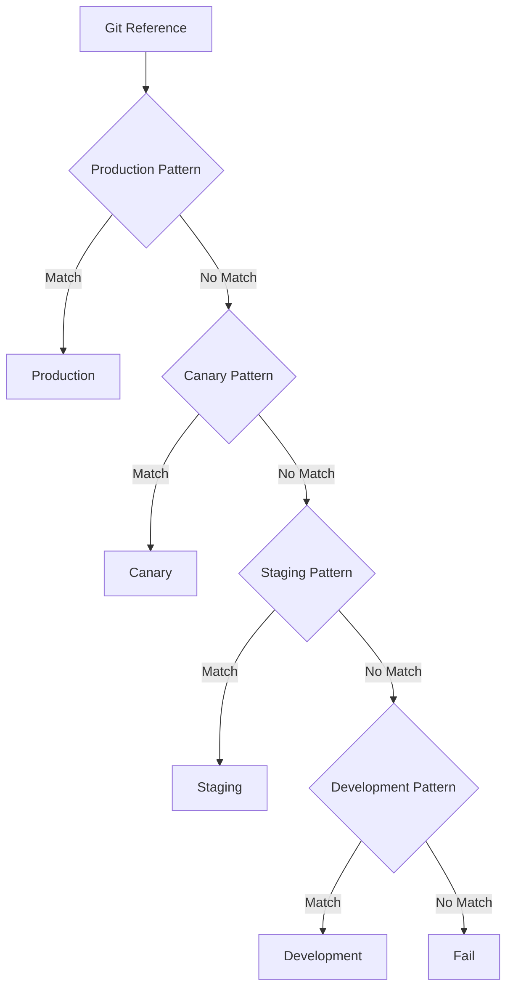

---

### Use Case 1 - GitFlow

```yaml
- uses: ionehouten/devops-kangservice/.github/actions/env-prepare-auto@main
  with:
    development_pattern: "^(develop|feature/.*)$"
    staging_pattern: "^main$"
```

| Git Reference | Environment |
| ------------- | ----------- |
| develop       | Development |
| feature/v1.0  | Development |
| main          | Staging     |
| v1.0.0-rc.1   | Canary      |
| v1.0.0        | Production  |

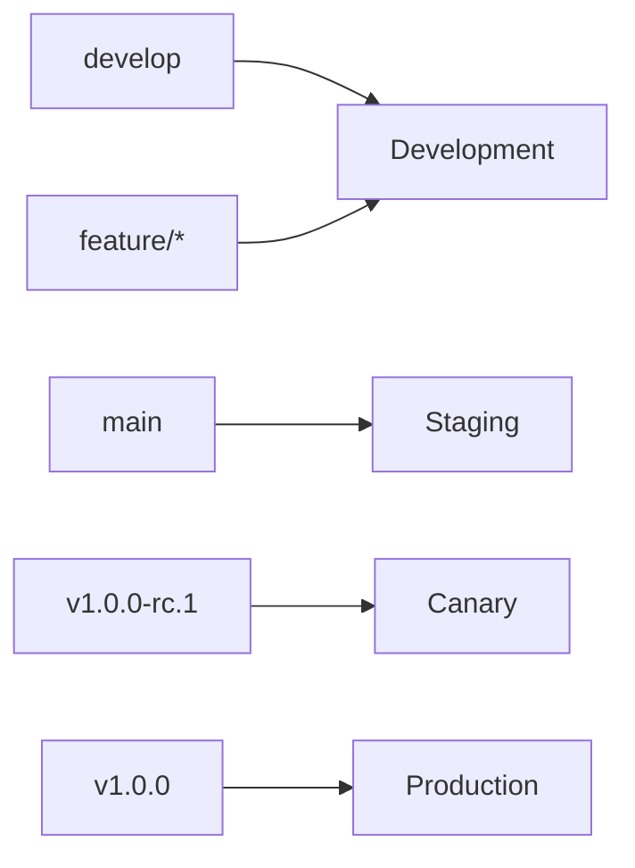

---

### Use Case 2 - Feature Branch Promotion

```yaml
- uses: ionehouten/devops-kangservice/.github/actions/env-prepare-auto@main
  with:
    development_pattern: "^main$"
    staging_pattern: "^(develop|feature/.*)$"
```

| Git Reference   | Environment |
| --------------- | ----------- |
| develop         | Development |
| feature/login   | Development |
| feature/payment | Development |
| main            | Staging     |
| v1.0.0          | Production  |

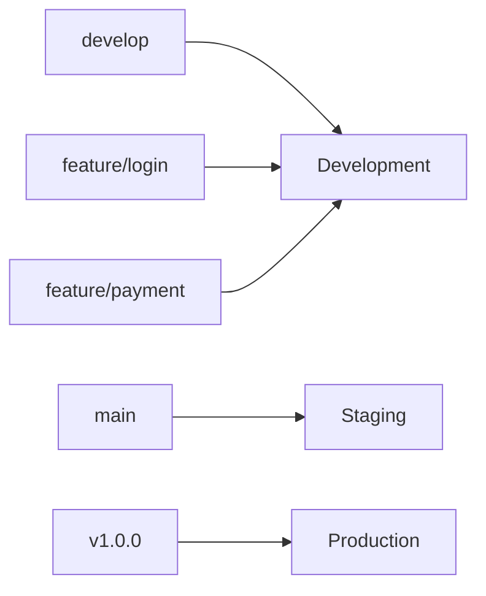

---

## Outputs

Both actions expose identical outputs.

| Output             | Description              |
| ------------------ | ------------------------ |
| environment        | Target environment       |
| environment_suffix | Environment suffix       |
| image_suffix       | Image environment suffix |
| overlays_path      | Kubernetes overlay path  |


---

# Versioning Action

Generates image versions and container image tags automatically.

## Inputs

| Input          | Required | Description             |
| -------------- | -------- | ----------------------- |
| registry_image | Yes      | Container registry path |
| image_suffix   | No       | Optional image suffix   |

## Outputs

| Output           | Description       |
| ---------------- | ----------------- |
| short_sha        | Git short SHA     |
| version          | Generated version |
| image_tag        | Full image tag    |
| image_tag_latest | Latest image tag  |

## Versioning Flow

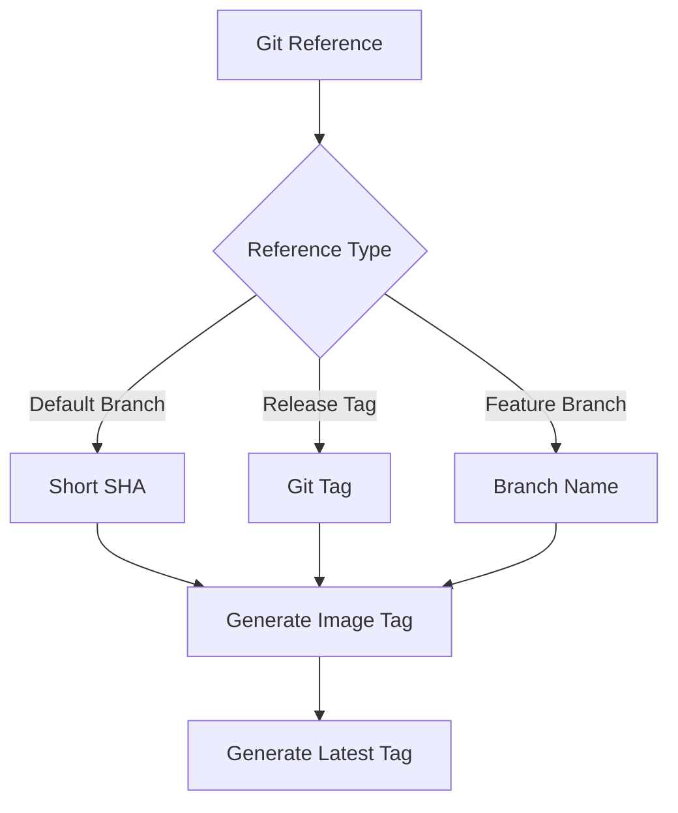

---

# Recommendations

| Scenario                                                      | Recommended Action |
| ------------------------------------------------------------- | ------------------ |
| Developers choose deployment target manually                  | env-prepare-manual |
| Environment determined automatically from branch/tag strategy | env-prepare-auto   |
| GitFlow branching model                                       | env-prepare-auto   |
| Multi-team deployment platform                                | env-prepare-manual |
| Standard image versioning                                     | versioning-action  |

```
```
